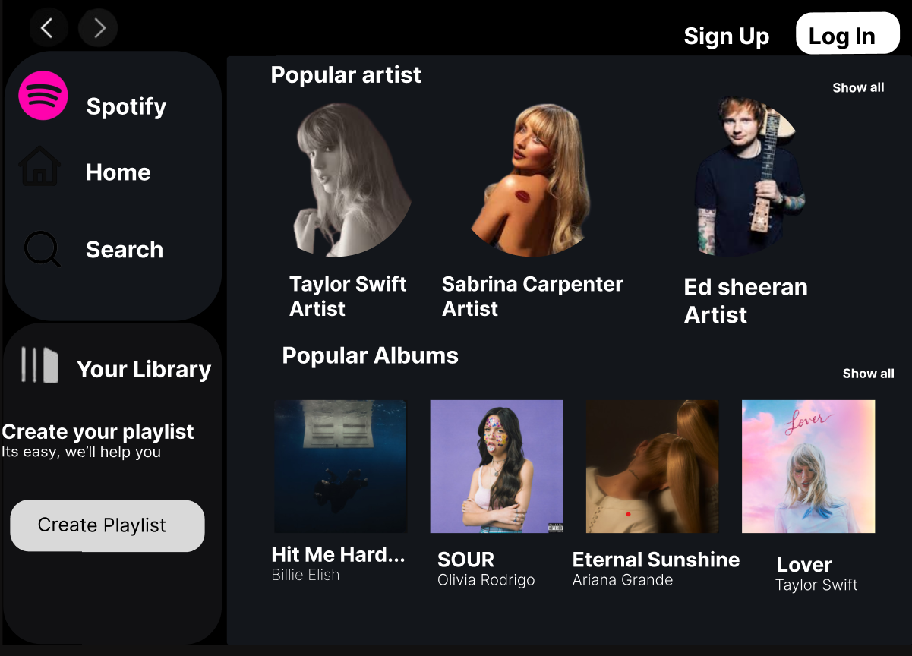

**Reflection on Replicating the Spotify Homepage in Figma**

### a) Documentation

**Main Concepts Applied**  
In replicating Spotify’s homepage in Figma, I focused on layout structure, typography, and component creation. Key concepts included utilizing Figma’s **Auto Layout** to organize elements efficiently and applying **Grids and Frames** to ensure alignment and consistent spacing. This approach helped me create a clean and organized layout that mirrored Spotify's structure.

**New Skills and Knowledge Acquired**  
Through this task, I learned how to create **reusable components**, which allowed me to replicate similar sections of the Spotify homepage quickly and consistently. Additionally, I improved my ability to use Figma’s **Plugins and Widgets** to source and adjust icons needed for the page, which saved time and enhanced the overall accuracy of the design. Another significant skill was utilizing **Color Styles** and **Text Styles** to streamline color and typography management across the page, which made adjustments more efficient and kept the design consistent.

### b) Reflection

**Learning Outcomes**  
This exercise strengthened my familiarity with Figma’s advanced features and highlighted the importance of **design consistency and hierarchy**. Replicating Spotify’s design helped me understand how to create a user interface that feels both inviting and easy to navigate, aligning with real-world design standards for a polished and cohesive look.

**Challenges Faced**  
A primary challenge was replicating Spotify's unique, slightly curved card designs for featured playlists. Initially, I struggled with creating and aligning these shapes. However, after researching and experimenting with Figma’s vector editing tools, I was able to create custom shapes and refine their alignment within the layout.

Another challenge was matching Spotify’s specific color gradients, which required fine adjustments for accuracy. To resolve this, I used Figma’s **Eyedropper Tool** and gradient editor to achieve a close match to Spotify’s style. This process taught me valuable techniques for gradient manipulation and color matching.

**Screenshot**  
  
The screenshot above shows the replicated Spotify homepage in Figma, highlighting the navigation elements, artist cards, and album section I created. This visual reference demonstrates the challenges I faced with component alignment and color matching, and how I addressed them.

### c) Clarity & Coherence

This reflection clearly outlines the skills and concepts applied in the project, my learning journey, and the challenges I encountered, providing a cohesive overview of the design process. The structure allows for easy navigation through each stage of the task, offering insight into my approach and the practical application of Figma tools.

