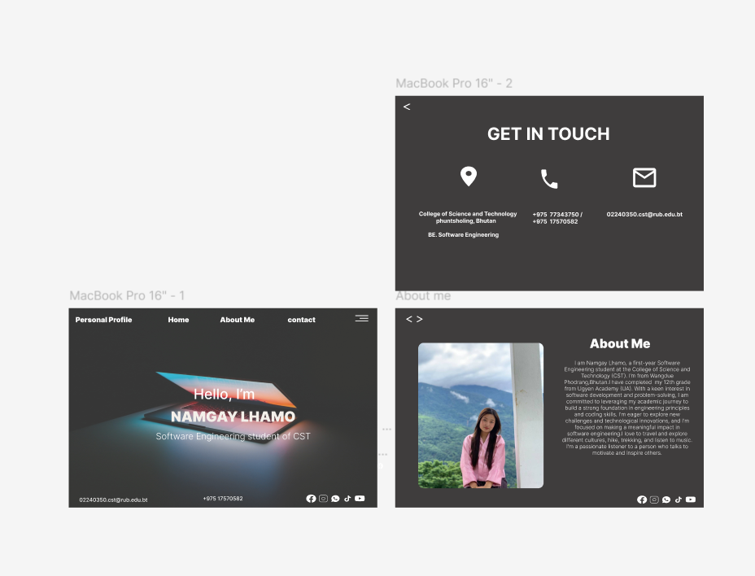

**Reflection on Designing My Personal Portfolio Website in Figma**

### a) Documentation 

**Main Concepts Applied**  
In designing my portfolio website, I focused on core concepts such as **responsive design, layout structure, and interactive prototyping**. Responsive design was a priority to ensure the site looked good on both desktop and mobile screens. I used Figma’s **Auto Layout** for structured content blocks and **Grids** for alignment, allowing me to maintain consistent spacing and layout across different pages.

**New Skills and Knowledge Acquired**  
Through this project, I learned how to work with **Constraints and Resizing** in Figma, which helped me adapt my layout smoothly across different screen sizes. I also experimented with **Prototyping Tools** to add interactive elements like page transitions, giving my portfolio a more engaging, professional feel. 

### b) Reflection 

**Learning Outcomes**  
This project emphasized the importance of **design consistency and visual hierarchy**. Creating the Home, About Me, and Contact pages helped me understand how to balance visuals and text, ensuring clarity and a cohesive aesthetic. I also gained a deeper understanding of how subtle interactions, like hover effects, can enhance user experience.

**Challenges Faced**  
One of the main challenges was ensuring the layout remained consistent and functional across different screen sizes. Initially, I struggled with keeping elements in proportion when transitioning from desktop to mobile views. By using Figma’s **Auto Layout and Constraints** features, I was able to control element behavior on different screens more effectively.

Another challenge was creating a smooth transition between pages in the prototype. Setting up interactions with Figma’s **Smart Animate** proved challenging at first, but after adjusting timing and layers, I achieved a more polished effect. This process improved my understanding of animation settings within Figma.

**Screenshot**  

[linked website](https://www.figma.com/design/rl5U68fTHiSYH3yNwi03Y4/Practical2_personal-profile?t=maNUxwaTWsLf1A0A-1)
The screenshot above displays the Home, About Me, and Contact sections I created for my portfolio website. This visual reference showcases the layout structure, alignment, and interactive elements, as well as the challenges I faced with responsive design and prototyping transitions.

### c) Clarity & Coherence

This reflection provides a well-organized overview of the skills and concepts applied in the project, my learning outcomes, and the challenges encountered. Each section flows logically, offering a clear insight into my design process and the practical application of Figma tools for a responsive, interactive portfolio.

